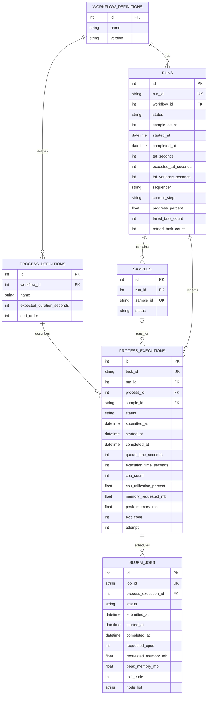

# FlowMetrics

## Frontend development

Open the project in VS Code and run **Dev Containers: Reopen in Container** from
the Command Palette. VS Code attaches to the frontend container, where the
workspace TypeScript compiler and React dependencies are installed. The database
and backend services start alongside it.

## Backend layout

```text
backend/
└── app/
	├── routes/
	├── db/
	├── models/
	├── schemas/
	├── services/
	└── seed/
```

## Database schema



## Seed the database

Start the stack with `docker compose up --build`, then run the seed command:

```sh
docker compose exec backend python -m app.seed
```

By default, the seeder creates 32 synthetic runs balanced across 24-, 48-,
96-, and 384-well plates, with queued, running, completed, failed, and cancelled
runs distributed across workflow steps. Faker and a fixed random seed make
generated random details reproducible; timestamps are relative to seeding time.
Change the run count or seed with
`docker compose exec backend python -m app.seed --runs 40 --seed 1234`.
Existing generated records are left unchanged, so rerunning with the same seed
is safe; increasing the count adds records. Well positions are included in
sample IDs, such as `SIM-42042-0001-A01`.
