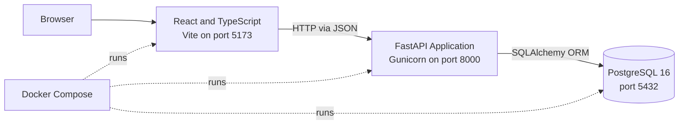
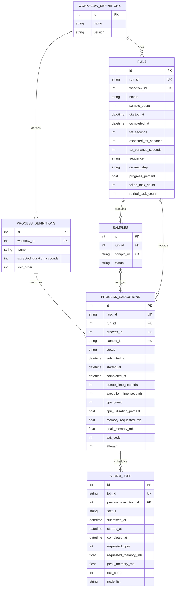

# FlowMetrics

## Architecture



## Infrastructure

- **Frontend:** Node 22 Alpine container serving the Vite development server on port `5173`.
- **Backend:** Python 3.12 container running FastAPI through Gunicorn and Uvicorn workers on port `8000`.
- **Database:** PostgreSQL 16 Alpine on port `5432`.

## Dependencies

**Backend** dependencies are managed in `backend/requirements.txt`:

- FastAPI, Gunicorn, and Uvicorn worker
- SQLAlchemy and Psycopg 3
- Faker for seedign data

**Frontend** dependencies are managed in `frontend/package.json` and locked in `frontend/package-lock.json`:

- React 19 and TypeScript
- Vite 7 and the React Vite plugin
- Bootstrap 5 and Bootstrap Icons
- PrimeReact and PrimeIcons for specialized widgets

## Backend directories

```text
backend/
└── app/
    ├── db/
    ├── models/
    ├── routes/
    ├── schemas/
    ├── seed/
    └── services/
```

## Frontend directories

```text
frontend/
└── src/
    ├── app/
    ├── features/
    ├── lib/
    └── styles/
```

## Database schema



## Seed the database

Start the stack:

```sh
docker compose up --build
```

In another terminal (or detach the current terminal), seed the database:

```sh
docker compose exec backend python -m app.seed
```

By default, this creates 32 synthetic runs balanced across 24-, 48-, 96-, and
384-well plates, with queued, running, completed, failed, and cancelled runs.
The fixed default seed (`42042`) makes generated random details reproducible;
timestamps are relative to seeding time.

Set a different run count or seed with:

```sh
docker compose exec backend python -m app.seed --runs 40 --seed 1234
```

Existing generated records are left unchanged. Rerunning with the same seed is
safe; increasing the run count adds records. Sample IDs include well positions,
such as `SIM-42042-0001-A01`.

## Frontend development

### Open the development container

Install Docker Desktop and the VS Code Dev Containers extension. Open the
FlowMetrics repository in VS Code, then run **Dev Containers: Reopen in
Container** from the Command Palette (`Cmd+Shift+P`). The devcontainer starts
the `db`, `backend`, and `frontend` services and opens the frontend source at
`/app`.

When the services are ready, open the frontend at <http://localhost:5173>.
The FastAPI documentation is available at <http://localhost:8000/docs>.
Changes to frontend source files are picked up by Vite automatically.

### Reload or rebuild

To refresh the VS Code window, run **Developer: Reload Window** from the
Command Palette. If you change `.devcontainer/devcontainer.json`, a Dockerfile,
or the container setup, run **Dev Containers: Rebuild and Reopen in Container**
so VS Code recreates the development environment with the updated settings.
